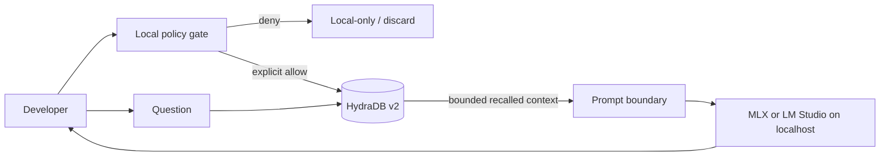

# Hydra MLX Troubleshooter

An MLX agent that stops repeating the same setup mistakes. It remembers the
Mac, learns from previous runtime failures, and never sends secrets to
persistence. Model generation stays local through
[MLX](https://github.com/ml-explore/mlx) or
[LM Studio](https://lmstudio.ai/docs/developer/openai-compat).

This repository is a competition entry and an implementation companion for the
[HydraDB × Docs hackathon](https://luma.com/event/evt-asAD7QFCSL8GKbf), running
July 17 to 24, 2026. The submission fixes one complete developer journey:

> Diagnose a local-model configuration using a measured device profile, a shared
> compatibility runbook, and a real load failure learned from LM Studio
> logs. The guide shows which approved context leaves the Mac.

## The proof, not the promise

The demo starts with no context and scores **0/3 required facts**. It then stores:

- the measured M4 Pro / 24 GB profile as explicit Memory;
- an MLX-VLM compatibility runbook as Knowledge; and
- a real, twice-observed KV-cache load failure as an inferred Memory outcome.

A fresh context session recalls all three and scores **3/3**. The actual local
27B MLX model uses them to reject the incompatible configuration and recommend
disabling KV cache quantization. A credential-shaped write is blocked before
persistence.

## Why this developer journey matters

Most memory tutorials stop at API calls. This one resolves the decisions that
cause real integration failures:

- **Memory or Knowledge?** Personal preferences and outcomes are Memory; shared
  reference material is Knowledge.
- **`infer: true` or `false`?** Infer only from raw, consented signals. Store an
  already-distilled fact verbatim with `false`.
- **Where does data go?** Model inference stays on the Mac. Context explicitly
  approved for persistence is sent to HydraDB. Secrets and denied material do not.
- **Which API generation?** The reference code uses HydraDB v2 primitives from
  the upstream `AGENTS.mdx`: databases, unified context ingestion, and query.
- **How does a local model consume it?** Recall is rendered as a bounded,
  untrusted context block and sent to an OpenAI-compatible localhost server.

## Architecture



The trust boundary is the point, not a footnote. See [the architecture](docs/ARCHITECTURE.md),
[privacy model](docs/PRIVACY.md), and [competition plan](docs/COMPETITION.md).

## Run the demo

With a chat model loaded in LM Studio or another localhost MLX server:

```bash
./demo/run.sh
```

The default mode is a clearly labeled deterministic lab run. It proves the
workflow and real localhost generation without claiming a HydraDB network call.

For the competition recording, require real HydraDB and prohibit fallback:

```bash
HYDRA_DB_API_KEY=... ./demo/run.sh --live
```

`--live` fails immediately if the key is missing, creates a fresh HydraDB client
for the second session, waits until each source is searchable, and only passes
after three focused queries independently recall their required facts. See the
[90-second narrative](docs/DEMO.md) and
[verification report](docs/VERIFICATION.md).

The strict live proof passed on July 18, 2026: real HydraDB, a fresh SDK client,
the localhost `ternary-bonsai-27b-mlx` model, and no simulator fallback. The
captured benchmark improved from **0/3 to 3/3**.

The repository also includes a
[sanitized host and failure capture](artifacts/host-and-failure-evidence.txt), so
the learned incident can be audited without publishing conversations or unrelated logs.

## Quick start

1. Start an OpenAI-compatible local server.

   LM Studio defaults to `http://127.0.0.1:1234/v1`. For `mlx_lm.server`, set
   `LOCAL_LLM_BASE_URL` to the server address you chose.

2. Install and configure.

   ```bash
   python -m venv .venv
   source .venv/bin/activate
   pip install -e '.[dev]'
   cp .env.example .env
   ```

3. Inspect before sending anything to HydraDB.

   ```bash
   hydra-mlx init
   hydra-mlx classify "I prefer concise code reviews"
   hydra-mlx remember "This Mac is an M4 Pro with 24 GB unified memory" --allow-egress
   hydra-mlx ask "Why did the MLX-VLM configuration fail to load?"
   ```

`--allow-egress` is deliberately required for writes. The CLI refuses likely
secrets and does not upload files implicitly.

## Submission artifacts

- [`SUBMISSION.md`](SUBMISSION.md): current status, remaining work, proof links,
  and the final release checklist.
- [`submission/`](submission/): recording script, pull request body, Discord post,
  and organizer message.
- [`contribution/local-model-context.mdx`](contribution/local-model-context.mdx):
  PR-ready Mintlify cookbook for the HydraDB docs.
- [`docs/DECISIONS.md`](docs/DECISIONS.md): Memory/Knowledge and inference decision tables.
- [`docs/ARCHITECTURE.md`](docs/ARCHITECTURE.md): data flow, failure modes, and interfaces.
- [`docs/PRIVACY.md`](docs/PRIVACY.md): egress contract and non-endorsement policy.
- [`docs/COMPETITION.md`](docs/COMPETITION.md): judging thesis and delivery sequence.
- [`docs/DEMO.md`](docs/DEMO.md): runnable proof and spoken demo narrative.

## Honest limitations

- HydraDB persistence is remote; this is **local inference**, not a fully local stack.
- The v2 SDK contract is taken from the current upstream agent integration guide.
  The public conceptual pages still contain legacy v1 examples. That mismatch is
  one of the documentation problems this submission surfaces and fixes.
- This project is not affiliated with or endorsed by Apple, MLX, LM Studio,
  HydraDB, Hugging Face, or any individual used as a design-review persona.

## License

MIT
