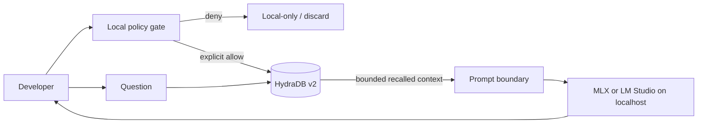

# Hydra MLX Context

Persistent, consent-gated context for models that run locally through
[MLX](https://github.com/ml-explore/mlx) or
[LM Studio](https://lmstudio.ai/docs/developer/openai-compat).

This repository is a competition entry and an implementation companion for the
[HydraDB × Docs hackathon](https://luma.com/event/evt-asAD7QFCSL8GKbf), running
July 17–24, 2026. The submission fixes one complete developer journey:

> Give a local Apple Silicon model durable memory and project knowledge without
> misleading users about which data stays on device.

## Why this should win

Most memory tutorials stop at API calls. This one resolves the decisions that
cause real integration failures:

- **Memory or Knowledge?** Personal preferences and outcomes are Memory; shared
  reference material is Knowledge.
- **`infer: true` or `false`?** Infer only from raw, consented signals. Store an
  already-distilled fact verbatim with `false`.
- **Where does data go?** Model inference stays on the Mac. Context explicitly
  approved for persistence is sent to HydraDB. Secrets and denied material do not.
- **Which API generation?** The reference code uses HydraDB v2 primitives from
  the upstream `AGENTS.mdx`: databases, unified context ingestion, and query.
- **How does a local model consume it?** Recall is rendered as a bounded,
  untrusted context block and sent to an OpenAI-compatible localhost server.

## Architecture



The trust boundary is the point, not a footnote. See [the architecture](docs/ARCHITECTURE.md),
[privacy model](docs/PRIVACY.md), and [competition plan](docs/COMPETITION.md).

## Quick start

1. Start an OpenAI-compatible local server.

   LM Studio defaults to `http://127.0.0.1:1234/v1`. For `mlx_lm.server`, set
   `LOCAL_LLM_BASE_URL` to the server address you chose.

2. Install and configure.

   ```bash
   python -m venv .venv
   source .venv/bin/activate
   pip install -e '.[dev]'
   cp .env.example .env
   ```

3. Inspect before sending anything to HydraDB.

   ```bash
   hydra-mlx init
   hydra-mlx classify "I prefer concise code reviews"
   hydra-mlx remember "I prefer concise code reviews" --allow-egress
   hydra-mlx ask "How should you review my patch?"
   ```

`--allow-egress` is deliberately required for writes. The CLI refuses likely
secrets and does not upload files implicitly.

## Submission artifacts

- [`contribution/local-model-context.mdx`](contribution/local-model-context.mdx):
  PR-ready Mintlify cookbook for the HydraDB docs.
- [`docs/DECISIONS.md`](docs/DECISIONS.md): Memory/Knowledge and inference decision tables.
- [`docs/ARCHITECTURE.md`](docs/ARCHITECTURE.md): data flow, failure modes, and interfaces.
- [`docs/PRIVACY.md`](docs/PRIVACY.md): egress contract and non-endorsement policy.
- [`docs/COMPETITION.md`](docs/COMPETITION.md): judging thesis and delivery sequence.

## Honest limitations

- HydraDB persistence is remote; this is **local inference**, not a fully local stack.
- The v2 SDK contract is taken from the current upstream agent integration guide.
  The public conceptual pages still contain legacy v1 examples. That mismatch is
  one of the documentation problems this submission surfaces and fixes.
- This project is not affiliated with or endorsed by Apple, MLX, LM Studio,
  HydraDB, Hugging Face, or any individual used as a design-review persona.

## License

MIT
