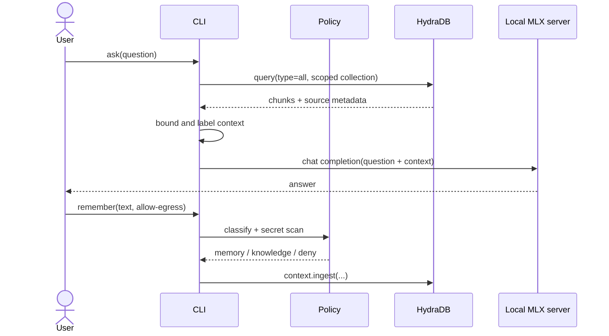

# Architecture

## Product thesis

Local model runners solve inference privacy and latency. They do not solve
durable, structured context. HydraDB can provide persistence and graph-aware
recall, but it introduces a remote data boundary. Hydra MLX Troubleshooter uses
that composition for one measurable workflow: recover the device profile, sizing
runbook, and prior runtime failure in a fresh session, while keeping the boundary
visible and consent-gated.

## Components

1. **Policy gate** classifies every proposed write as `memory`, `knowledge`, or
   `deny`. It blocks likely secrets and private file classes.
2. **Hydra adapter** uses the canonical v2 SDK surface: `databases`, `context`,
   and `query`. All responses are unwrapped through `.data`.
3. **Prompt boundary** treats recalled context as untrusted data, labels it, and
   caps the number and size of chunks.
4. **Local OpenAI adapter** calls only an explicitly configured loopback URL.
5. **CLI** makes egress intentional. Writes require `--allow-egress`.
6. **Context benchmark** tests the required evidence, not model vibes: cold
   context is 0/3 and the learned session must recover all 3/3 facts.

## Runtime sequence

## Interfaces

The application core depends on two small protocols:

- `ContextStore.recall(query) -> list[ContextChunk]`
- `LocalModel.complete(messages) -> str`

This keeps the MLX runner replaceable and lets tests verify the security-critical
prompt and policy behavior without network access.

## Failure handling

| Failure | Behavior |
|---|---|
| Local model unavailable | Fail locally; do not fall back to a cloud model |
| Hydra unavailable | Explain that durable context is unavailable; never invent recall |
| Secret-like write | Deny before network initialization |
| Empty recall | Ask the local model without Hydra context and label the absence |
| Oversized recall | Truncate per chunk and cap total chunks |
| Prompt injection in recalled text | Delimit as untrusted evidence; system rules remain outside it |
| Ingestion still indexing | Poll only to a bounded timeout; report the source ID |
| API version mismatch | Surface an actionable v2 contract error; do not silently try legacy endpoints |
| Missing live-demo credential | `--live` exits; it never substitutes the simulator |

## Scope model

For this competition prototype:

- database: one stable app/database identifier
- collection: one pseudonymous local user/project identifier
- Knowledge: project docs explicitly approved for egress
- Memory: explicit preferences, decisions, and consented interaction signals

A production multi-user system should separate customer databases and use
collections for workspace/team/user partitions, matching HydraDB’s v2 guidance.
